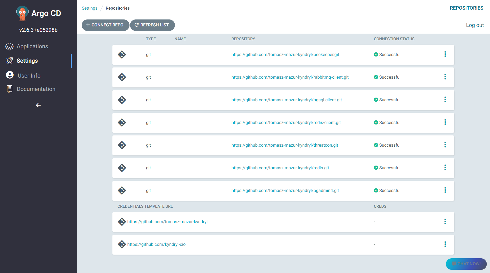

# 12/03/23 DRAFT 1

# ArgoCD – Deploy your first application

## Overview of ArgoCD
**ArgoCD** is a declarative, GitOps continuous delivery tool for K8s. **ArgoCD** supports a variety of configuration management tools, including kustomize and Helm. It extends the benefits of declarative and Git-based configuration management to accelerate application deployment and lifecycle management without compromising security and compliance.

It follows the GitOps pattern of using Git repositories as the source of truth for defining the desired application state.

## ArgoCD core features

Some of **ArgoCD** best features are:

- Automated deployment — It can automate your application deployment process into K8s. **ArgoCD** supports deployment into multiple clusters hosted on a public cloud (AWS/GCP/Azure) or on-prem data center.
- GitOps style deployment — Achieve GitOps style software delivery. It declares the desired state of an application in Git, and **ArgoCD** will automatically synchronize the application configuration to the currently declared state.
- Deployment Strategies — Quickly rollback any applications to any previous versions in Git.
- SSO Integration — Easily enable access for your teams to **ArgoCD** with built-in integrations for SSO providers such as OIDC, OAuth2, LDAP, SAML 2.0, GitHub, GitLab, Microsoft, etc.
- Multi-tenancy and RBAC policies for authorization.
- Health status analysis of application resources.
- Web UI which provides real-time view of application activity.
- Prometheus metrics.

 

## Deploy a Sample Application

The **ArgoCD** API server, at the time of writing this manual, is not exposed to an external IP. The only way to access it, is via *test-jump* host and local proxy configuration (e.g. *FoxyProxy*).  Once everything is set up, the ArgoCD will be available at `https://argocd.test.security.kyndryl.net`. Access the **ArgoCD** console by logging in with your username and the password (no integration with SSO yet so you must ask the **ArgoCD** administrator for credentials).

Once you’ve logged in, you should see the following page. This is the **ArgoCD** main window. The contents of the window may vary depending on the project you belong to.

Before you start deploying sample application and assuming that the **Project** (see note below) has been already defined by the **ArgoCD** administrator, there are a three things you should set up:

1. Add credentials template (optional)
2. Add Git repository to ArgoCD. The repository contains the manifests that define the application state.
3. Define and deploy a sample application.

**Note**. Projects provide a logical grouping of applications, which is useful when **ArgoCD** is used by multiple teams. Every application belongs to a single project. Projects provide the following features:

- Restrict *what* may be deployed (trusted Git source repositories only).
- Restrict *where* apps may be deployed to (destination clusters and namespaces).
- Restrict what kinds of objects may or may not be deployed (e.g. RBAC, CRDs, DaemonSets, NetworkPolicy, etc).
- Defining project roles to provide application RBAC (bound to OIDC groups).

#### 1. Create credentials template

Optionally you can set up credentials template to serve as templates for connecting repositories, without having to repeat credential configuration. For example, if you setup credential templates for the URL prefix `https://github.com/kyndryl-cio`, these credentials will be used for all repositories with this URL as prefix (e.g. `https://github.com/kyndryl-cio/argocd-demo`) that do not have their own credentials configured.

To set up a credential template using the Web UI, simply fill in all relevant credential information in the `CONNECT REPO USING HTTPS` but select `SAVE AS CREDENTIALS TEMPLATE` instead of `CONNECT` to save the credential template. 

To start, click on the gear icon, which will take you to the settings of **ArgoCD** as shown in this image.

Click `Repositories/+ CONNECT REPO` button and fill in all relevant information, i.e.:

1. Connection method: `VIA HTTPS`
2. Type: `git`
3. Project: `demo`
4. Repository URL: `https://github.com/kyndryl-cio`
5. Username: `whatever`
6. Password: `git token with read-only privileges`

Be sure to only enter the prefix URL (i.e. `https://github.com/kyndryl-cio`) instead of the complete repository URL (i.e. `https://github.com/kyndryl-cio/argocd-demo`) in the field `Repository URL`. When you're done, click `SAVE AS CREDENTIALS TEMPLATE`.

After returning to the main repository configuration page, at the bottom, you will see just created template.

#### 2. Add Git repository to ArgoCD

Once again, click on `Settings/Repositories/+ CONNECT REPO` button, which will take you to the same page you were on before and fill in all relevant information, i.e.:

1. Connection method: `VIA HTTPS`
2. Type: `git`
3. Project: `demo`
4. Repository URL: `https://github.com/kyndryl-cio/argocd-demo.git`

This time you have to give the full path to the repository but the credentials for it will be fetched from the template. Click `CONNECT` to test the connection and have the repository added.

Make sure the repository you just added has `CONNECTION STATUS` *Successful.* If not, either the token provided in the template is invalid or you are trying to connect to a repository that does not have a template defined. In this case, you either need to provide credentials directly at the time of adding the repository or correct the template.

#### 3. Define and deploy a sample application

This is where things get interesting and like the **ArgoCD** mascot says, let’s get stuff deployed! When creating an application, you will be presented with a form that will allow you to configure the Git repository source, the target cluster, and how you want **ArgoCD** to synchronize the source with the state of the target cluster. 

To start, click on the `Applications` on the left side menu and select `+ NEW APP`.

In the section `GENERAL`you must fill in or select, at least, the following parameters:

1. `Application Name`: it can be any name for your application.
2. `Project Name`: this must be the name assigned to your application/repository otherwise **ArgoCD** will refuse to deploy it. In this case, you can see the details of your Project by clicking `Settings/Projects/demo`.
3. `Sync Policy`: **ArgoCD** has the ability to automatically sync an application when it detects differences between the desired manifests in Git, and the live state in the cluster. A benefit of automatic sync is that CI/CD pipelines no longer need direct access to the **ArgoCD** API server to perform the deployment. Instead, the pipeline makes a commit and push to the Git repository with the changes to the manifests in the tracking Git repo. Automatic synchronization is not always desirable so always consider what is best in your particular case.
4. `Prune Resources`: if checked, **ArgoCD** will delete resources if they are no longer defined in your Git repository.
5. `Self-Healing`: by default, changes that are made to the live cluster will not trigger automated sync. If checked, **ArgoCD** will force automatic sync when the live cluster's state deviates from the state defined in Git.

In the next section, `SOURCE`, you must fill in on fields.

1. `Repository URL`: point your application to it's sources.
2. `Revision`: HEAD, main or any revision you have and like.
3. `Path`: make sure that path provided here, define the path for raw-manifest files.

In the `DESTINATION` section, you define on which cluster and in which namespace your application is to be launched. Generally, these settings are determined by the Project definition.

1. `Cluster Name` or `Cluster URL`: select appropriate cluster name. The name must match the name written in the Project otherwise **ArgoCD** will refuse to run the application.
2. `Namespace`:  provide a name for the namespace that belongs to the cluster selected above. Once again, the name must match the name defined in the Project.

The last section, selected from the list, is optional. But in our case, since we are using SSL certificates and secrets stored in Hashicorp Vault we need to choose `Plugin` and next, in the `Name` field, provide the plugin name we intend to use. In this particular case it will be `argocd-vault-plugin-kustomize`.

Before you click on `CREATE` you can make the final review of the application definition by analyzing the resulting `yaml` file. To do this, click on `EDIT AS YAML`. When the new window opens you will see the raw `yaml` file. By the way, you can copy the contents of the `yaml` file and if something goes wrong you can come back to this window, paste copied definition and make corrections. In this way, you can save a lot of time during debugging session.

If you make any changes don't forget to click `SAVE` first or if the application is ready to go click on `CREATE` and within a few seconds, **ArgoCD** will spin up the application. Once the application is running, **ArgoCD** gets to work and makes sure the target clusters state matches that of the desired state defined in the source repository.

The *Healthy* and *Synced* statuses signify that all the resources that should be applied have been created in the cluster and that they are running successfully.

To see more details about a running application, click anywhere inside the square.

Inside this window, clicking on each of the squares will give you even more information about the running application. But the most interesting is the option of direct access to application logs and, if necessary, direct access to the Pod.  To achieve this you must first click on the Pod rectangle and then select `LOGS`or `TERMINAL`.

Below is a window with an open application terminal. For security reasons, access to the terminal is not open but depends on the Project settings.

If you no longer need this application or you just lost interest in it, don't forget to delete it by clicking on `DELETE`in the main window of the application.

The information provided in this short material shows only a small part of the possibilities offered by **ArgoCD**. I really recommend spending some time messing around with **ArgoCD** to see how powerful this application is, although it has its weaknesses too :)

> That's all folks!
> "I have to kill that wabbit!"
> "It turns out to be rabbit, my fault...still I'm gonna kill him, nasty wabbit."
